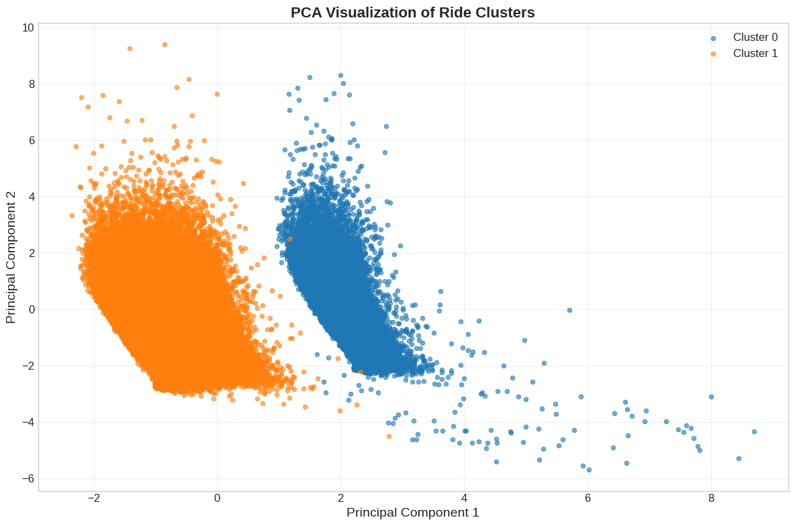
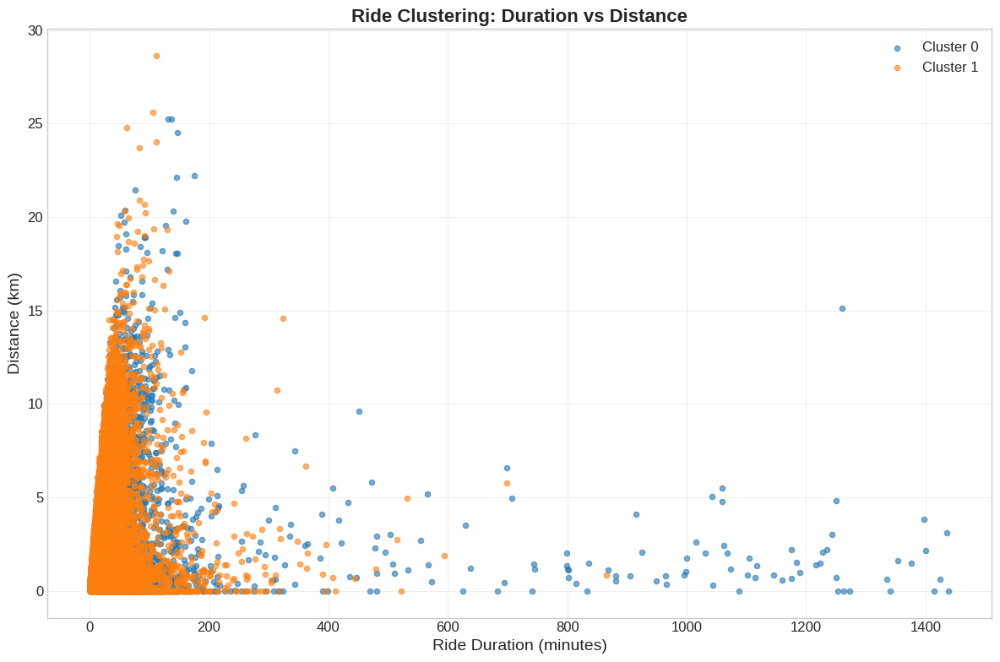
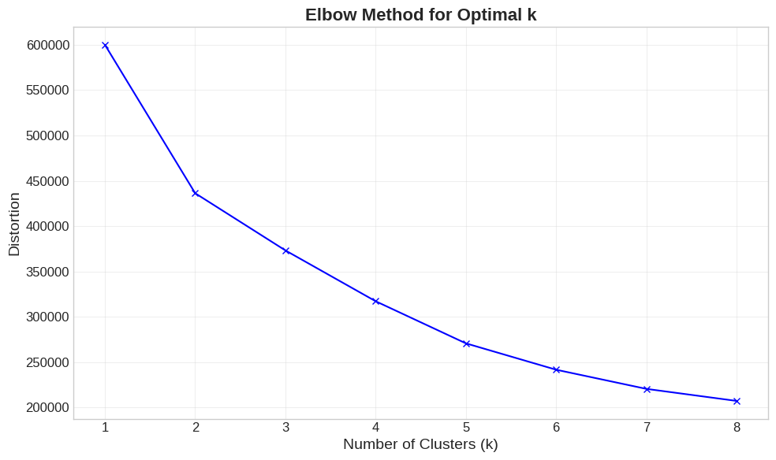
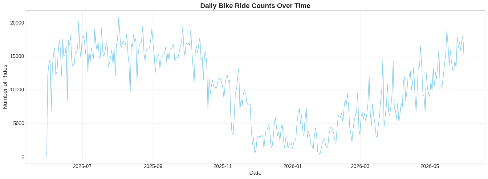
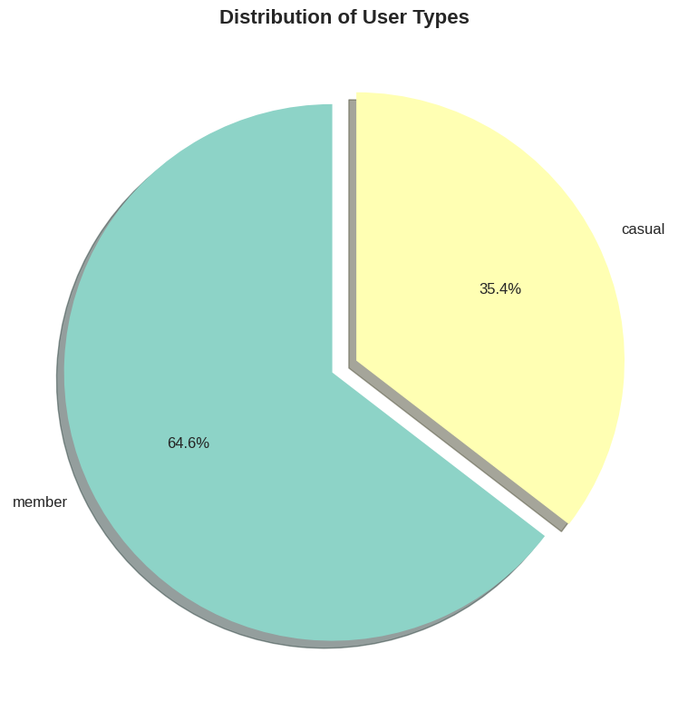
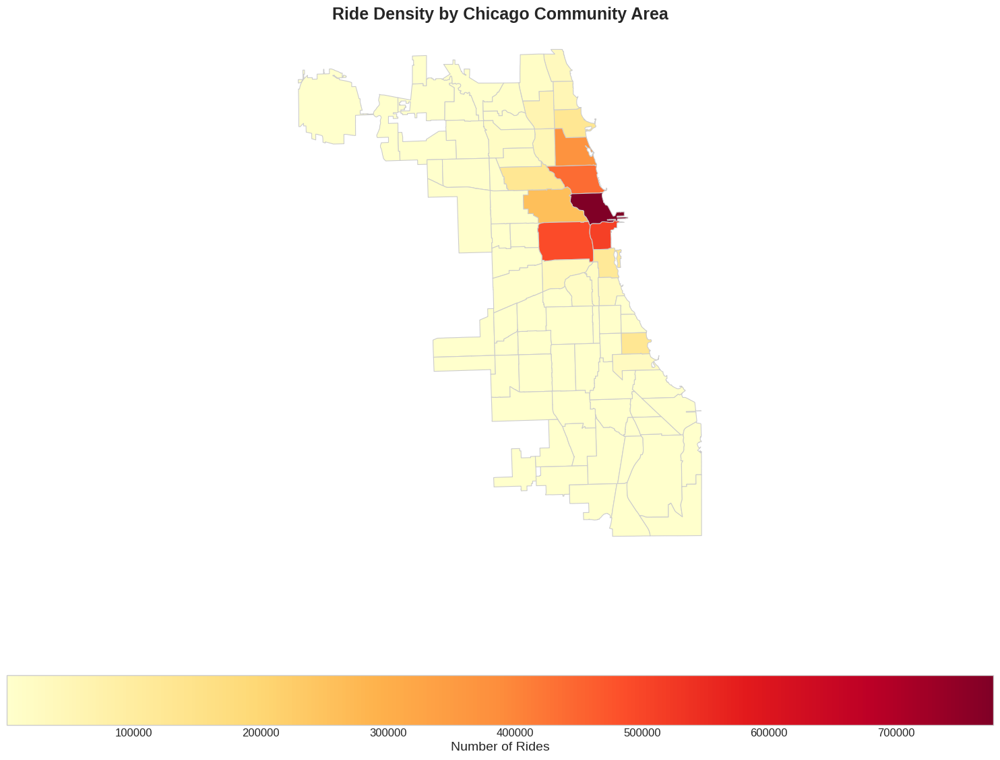
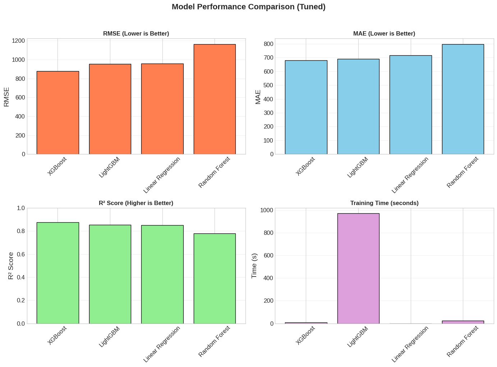
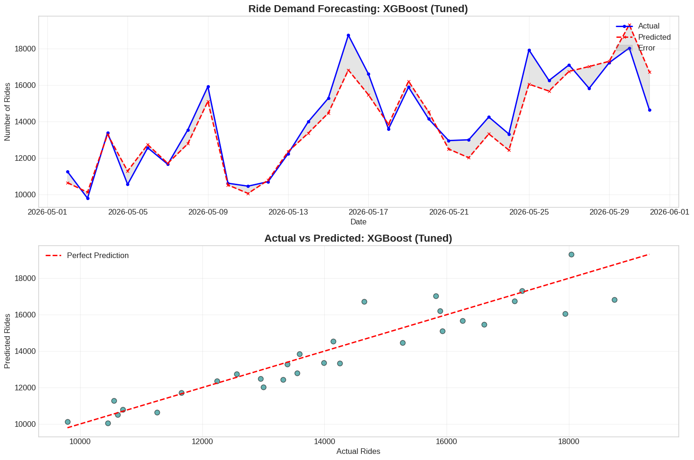

# Cyclistic Bike-Share Analysis

A Python-based data analysis project for exploring Cyclistic bike-share ridership patterns, rider behavior, and operational trends. The workflow includes data loading, cleaning, exploratory analysis, segmentation, and time-series insights designed for reproducible reporting and portfolio presentation.

## Project objective

This project analyzes how casual riders and annual members differ in their usage patterns, along with the temporal, geographic, and behavioral trends that shape bike-share demand. The goal is to uncover actionable insights that support rider engagement, membership conversion, and operational planning.

## Analysis highlights

<p align="center">
  
</p>

## Key findings

- Daily ridership shows clear seasonal and weekday-based patterns.
- Member and casual rider behavior differs substantially by time of day and trip duration.
- Geographic distribution highlights station demand concentrations across the network.
- Time-series analysis reveals recurring usage cycles that can inform marketing and staffing decisions.

## Project structure

- `Cyclistic.py` — project entry point for running the CLI analysis pipeline
- `cyclistic/` — modular package for loading, cleaning, EDA, segmentation, and time-series analysis
- `requirements.txt` — Python dependencies for the project
- `eda_outputs/` — generated charts and HTML outputs
- `assets/` — project screenshots and visual summaries for GitHub documentation

## Quick start

1. Create and activate a virtual environment:
   ```bash
   python -m venv .venv
   source .venv/bin/activate   # Linux/macOS
   .\.venv\Scripts\activate    # Windows
   ```
2. Install dependencies:
   ```bash
   pip install -r requirements.txt
   ```
3. Run the analysis:
   ```bash
   python Cyclistic.py --data-path path/to/dataset.csv
   ```

Optional GeoJSON mapping:

```bash
python Cyclistic.py --data-path path/to/dataset.csv --geojson-path path/to/areas.geojson
```

## Visual gallery

<div align="center">
  
  
</div>

<div align="center">
  
  
</div>

<div align="center">
  
  
</div>

<div align="center">
  
</div>

## Technical summary

This project is built to be easy to run from the command line and resilient across common Cyclistic data schema variations. It automatically searches common local and Kaggle-style locations for input data and supports optional GeoJSON spatial mapping.

## Notes

- The script will automatically search common local and Kaggle paths if no explicit path is supplied.
- Plot outputs are saved under `eda_outputs/`.
- The workflow is intentionally resilient to multiple Cyclistic schema variations.
- This project is structured for easy extension with additional forecasting, segmentation, or dashboard work.
